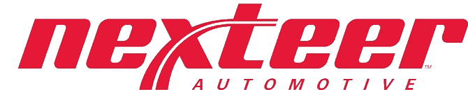
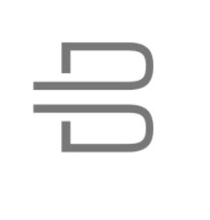

<!-- # Work Experience   -->
The part summaries li han's work experience.

 

### *HIL Test Engineer*
*Shanghai, CN*  
*Sept. 2022 – Oct. 2024*  
 

 

### *Senior Software Validation Engineer*  
*Shanghai, CN*  
*Oct. 2021 – Sept. 2022* 

 

### *Core Software Engineer*
*Suzhou, CN*  
*Aug. 2019 – Sept. 2021* 

 
 
### *Powertrain HIL Engineer*  
*Nanjing, CN*  
*Mar. 2018 – Aug. 2019* 
 

 

### *Software Test Engineer*  
*Ningde, CN*  
*Apr. 2016 – Feb. 2018* 

    