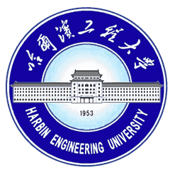
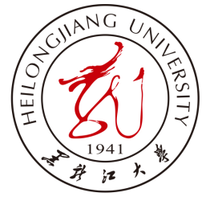

# Education

This page summaries li han's education background.

 
 
## Master of Engineering
### Harbin Engineering University
Major in Information and Communication Engineering  
*Harbin, CN*  
*Sep. 2013 - Mar. 2016*

 
 
## Bachelor of Engineering
### Heilongjiang University
Major in Electronic Information Science and Technology  
*Harbin, CN*  
*Sep. 2008 - Jul. 2012*  

